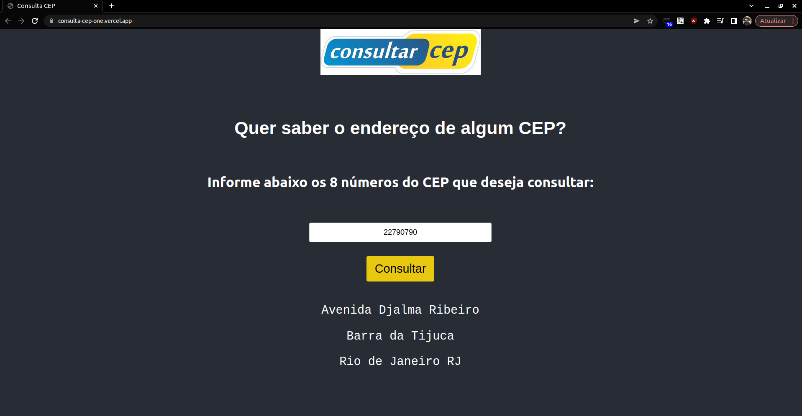

# Desafio técnico:

Esse projeto consiste em uma SPA (Single Page Application) que consome uma rota criada no backend para consultar e trazer o endereço do CEP digitado de uma API.
O frontend foi feito em React, utilizando VITE para buildar a aplicação e CSS puro para estilizar a página.
Já o backend, foi criado em NodeJS, utilizando o Express para iniciar o servidor.

## Funcionalidades:

- Responde o endereço para um CEP digitado;
- Verificação para exigir que sejam enviados 8 números;
- Proíbe o envio caso o valor digitado no input não seja no formato exigido;
- Retorna "CEP não encontrado" quando é digitado um CEP inexistente;

## Tecnologias:

Para realizar esse projeto, foi utilizado:
- Vite na versão 2.9.9, para iniciar o build da aplicação;
- Javascript com React na versão 18.0.0;
- React hooks para manipulação de estado;
- NodeJS na versão 14.18.1;
- Express.js na versão 4.18.1;
- Propriedade `pattern` para impossibilitar que o usuário insira dados fora do formato exigido;
- Estilização feita em CSS puro;
- Vercel para realizar o deploy;

## Deploy:

Realizei o deploy da aplicação utilizando Vercel.
- Dá pra checar o funcionamento da aplicação no link https://consulta-cep-one.vercel.app/ ou clicando na imagem abaixo: 

## Instalação e utilização local:

Para instalar e utilizar esse projeto localmente você precisa:
- Clonar o repositório com o comando `git clone git@github.com:pedro21medeiros/consulta-cep.git`;
- Entrar no diretório do projeto com o comando `cd consulta-cep`;
- Acessar o diretório frontend do projeto, `cd frontend-consulta-cep`;
- Instalar as dependências do frontend com `npm install`;
- Iniciar a aplicação React com o comando `npm run dev`;
- Voltar para o diretório do projeto com o comando `cd ..`;
- Acessar o diretório backend do projeto, `cd api`;
- Instalar as dependências do backend com `npm install`;
- Iniciar o servidor com o comando `node server.js`;

Agora, ao abrir o http://localhost:3000/, você verá a aplicação funcionar localmente.

Sinta-se livre para entrar em contato comigo através do meu LinkedIn 

Mais informações no meu perfil aqui no GitHub. ;D
